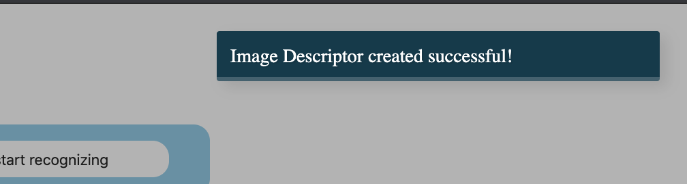

<p align="center"><h2>Realtime Face Recognition and Notification</h2></p>

## Dependencies

```shell
$ bower install noty
```

## run

open `index.html` with development local server or use vscode Live Server Extension and do

right click on `index.html` > open with Live Server.

## steps

- add your image to get recognized in Live Feeds from your webcam
- after seeing that image descriptor created successfully
- go ahead and start recognizing :tada: !
## screenshots

   
   
   

## Developer

Mucyo Fred e-mail: me at mucyofred dot com
